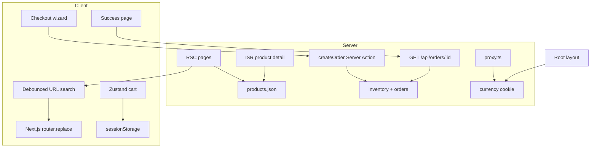

# Kora Market

Mobile-first headless commerce storefront on **Next.js 16** (App Router). Server-rendered catalog with ISR product pages, debounced URL search, a Zustand cart, and a multi-step checkout.

[](https://github.com/johnTubson/kora-market/actions/workflows/ci.yml)

**Live demo:** [kora-market-delta.vercel.app](https://kora-market-delta.vercel.app/)

## Features

- **Catalog** — RSC pages backed by JSON fixtures; product detail uses ISR
- **Search & filters** — debounced query updates URL params (shareable, back-button-safe); active filters shown as dismissible pills
- **Cart** — Zustand store with sessionStorage persistence
- **Checkout** — React Hook Form + Zod validation; Server Action re-checks inventory, reserves stock, and persists a recoverable order
- **Currency** — NGN/USD toggle with cookie persistence (Next.js proxy)
- **No external API** — MSW in dev, Route Handlers in production; deployable without backend credentials

## Architecture



Catalog pages render on the server from fixtures. Search and category filters sync to URL params. Cart state lives client-side; checkout revalidates stock on the server, reserves units, and redirects to a success page that loads the persisted order.

## Design decisions

| Area           | Approach                                | Notes                                                   |
| -------------- | --------------------------------------- | ------------------------------------------------------- |
| Catalog data   | RSC + in-memory JSON                    | Fast first paint; no API keys required                  |
| Search/filters | URL params + debounced `router.replace` | Shareable links; works with SSR                         |
| Cart           | Zustand + sessionStorage                | No server cart API needed for a static catalog          |
| Currency       | Proxy cookie seed                       | Layout reads cookie on SSR to avoid first-visit flicker |
| Client cache   | None (no TanStack Query)                | Static catalog; RSC already ships data                  |
| Checkout       | Server Action + inventory      | Stock reservation + order persistence; OOS conflicts stay on checkout |

Search updates the URL after 300ms of idle typing. External URL changes (filter pills, back button) sync back into the input via a `committedQueryRef` guard so the field only resets when the change did not come from the form’s own debounce.

```ts
// src/features/catalog/utils/catalog-url.ts
buildCatalogHref({ category: "fashion", q: "ankara" });
// → "/products?category=fashion&q=ankara"
```

## Stack

Next.js 16, React 19, TypeScript, Tailwind CSS 4, Zustand, React Hook Form, Zod, MSW, Vitest, Playwright, Lighthouse CI, Storybook.

## Setup

```bash
pnpm install
cp .env.example .env.local
pnpm dev
```

Open [http://localhost:3000](http://localhost:3000).

To fetch product images locally: `pnpm images:fetch`.

## Scripts

| Command           | Description            |
| ----------------- | ---------------------- |
| `pnpm dev`        | Dev server             |
| `pnpm build`      | Production build       |
| `pnpm lint`       | ESLint (+ jsx-a11y)    |
| `pnpm typecheck`  | TypeScript             |
| `pnpm test`       | Vitest (47 tests)      |
| `pnpm test:e2e`   | Playwright (5 tests)   |
| `pnpm lighthouse` | Lighthouse CI (mobile) |
| `pnpm storybook`  | Component docs         |

## Testing & quality

CI runs lint, typecheck, unit tests, e2e, and Lighthouse on mobile for `/`, `/products`, PDP, and `/cart` (performance ≥ 90, accessibility ≥ 95).

Accessibility: skip link, focus rings, checkout fieldsets with `aria-current`, confirm dialog for cart removal, reduced-motion support. SEO: `metadataBase`, Open Graph, `sitemap.ts`, `robots.ts`, Product JSON-LD on PDP.

## Bundle size

Approximate first-load JS per route (Next.js 16, Turbopack):

| Route              | First Load JS |
| ------------------ | ------------- |
| `/`                | ~120 kB       |
| `/products`        | ~115 kB       |
| `/products/[slug]` | ~125 kB       |
| `/cart`            | ~110 kB       |
| `/checkout`        | ~145 kB       |

Shared chunks (~85 kB) include React 19 and the Next.js runtime. Checkout is largest (React Hook Form + dynamic wizard steps). Run `pnpm build` for exact numbers.

## License

MIT
