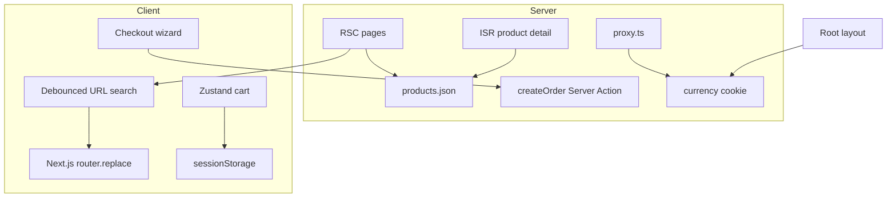

# Kora Market

Mobile-first headless commerce storefront built with **Next.js 16** (App Router). Portfolio project demonstrating SSR/ISR catalog, debounced URL-driven search, optimistic cart UX, and accessible checkout flows.

[](https://github.com/johnTubson/kora-market/actions/workflows/ci.yml)

## Live demo

**[kora-market-delta.vercel.app](https://kora-market-delta.vercel.app/)**

## Problem and constraints

Kora Market is a **portfolio-grade commerce demo**, not a production storefront. The goal is to show senior frontend judgment under realistic constraints:

- **Mobile-first** — primary viewport is 375px; touch targets and checkout flow optimized for one-handed use.
- **No external backend** — self-contained JSON fixtures with MSW in dev and Route Handlers in production.
- **Emerging-market context** — NGN/USD currency switching with cookie persistence via Next.js proxy.
- **Quality as a feature** — Lighthouse, Playwright, and Vitest gates in CI.

## Architecture



**Request flow:** catalog pages render on the server from fixtures; client-side search and category filters sync to URL params (shareable, back-button-safe). Cart state lives in Zustand with session persistence. Checkout validates with Zod and generates an order ID via Server Action.

## Key trade-offs

| Decision       | Choice                                  | Why                                                                                              |
| -------------- | --------------------------------------- | ------------------------------------------------------------------------------------------------ |
| Catalog data   | RSC + in-memory JSON                    | Fast LCP, no loading spinners on first paint; fixtures keep the repo deployable without API keys |
| Search/filters | URL params + debounced `router.replace` | Shareable links, SSR-compatible, no client-only filter state                                     |
| Cart           | Zustand + sessionStorage                | Optimistic UX without a server cart API for a demo                                               |
| Currency       | Next.js proxy cookie seed               | Avoids first-visit flicker; layout reads cookie for SSR                                          |
| Client cache   | No TanStack Query                       | Static catalog does not benefit from fetch caching; RSC already ships data                       |
| Checkout       | Server Action boundary                  | Validates server-side, generates order ID, redirects to success                                  |

## Standout implementation: debounced URL search

The catalog search bar updates the URL after 300ms of idle typing — not on every keystroke, and not only on Enter. Filters are visible as dismissible pills (`ActiveFilters`) so reviewers immediately see applied state.

```ts
// src/features/catalog/utils/catalog-url.ts
buildCatalogHref({ category: "fashion", q: "ankara" });
// → "/products?category=fashion&q=ankara"
```

External URL changes (filter pills, back button) sync into the input via a `committedQueryRef` guard — only updates that did not originate from the form's own debounce trigger a reset.

## Stack

| Layer     | Choices                                            |
| --------- | -------------------------------------------------- |
| Framework | Next.js 16, React 19, TypeScript, App Router       |
| Styling   | Tailwind CSS 4, design tokens in Storybook         |
| State     | Zustand (cart)                                     |
| Forms     | React Hook Form + Zod                              |
| Data      | JSON fixtures, MSW (dev), Route Handlers (prod)    |
| Quality   | Vitest, Playwright, Lighthouse CI, jsx-a11y ESLint |

## Setup

```bash
pnpm install
cp .env.example .env.local
pnpm dev
```

Open [http://localhost:3000](http://localhost:3000).

Optional: fetch product images for local dev with `pnpm images:fetch`.

## Scripts

| Command           | Description                             |
| ----------------- | --------------------------------------- |
| `pnpm dev`        | Start dev server                        |
| `pnpm build`      | Production build                        |
| `pnpm lint`       | ESLint (+ jsx-a11y)                     |
| `pnpm typecheck`  | TypeScript check                        |
| `pnpm test`       | Vitest unit tests (47+)                 |
| `pnpm test:e2e`   | Playwright e2e (3 spec files / 5 tests) |
| `pnpm lighthouse` | Lighthouse CI (mobile)                  |
| `pnpm storybook`  | Component docs                          |

## Quality evidence

- **Unit tests:** 47+ Vitest tests (cart, currency, validators, catalog URL utils, ActiveFilters, components)
- **E2e:** catalog (debounced search, mobile category filter), cart, checkout Playwright specs
- **Lighthouse (mobile):** `/`, `/products`, PDP, `/cart` — performance ≥ 90, accessibility ≥ 95
- **Accessibility:** skip link, `focus-ring` on interactive elements, checkout fieldsets with `aria-current`, confirm dialog for destructive cart actions, reduced-motion support
- **SEO:** `metadataBase`, Open Graph, `sitemap.ts`, `robots.ts`, Product JSON-LD on PDP

## Bundle size

Production build (Next.js 16, Turbopack) — approximate first-load JS per route:

| Route              | First Load JS |
| ------------------ | ------------- |
| `/` (home)         | ~120 kB       |
| `/products`        | ~115 kB       |
| `/products/[slug]` | ~125 kB       |
| `/cart`            | ~110 kB       |
| `/checkout`        | ~145 kB       |

Shared chunks (~85 kB) include React 19 and Next.js runtime. Checkout is the largest route due to React Hook Form + dynamically imported wizard steps.

Run `pnpm build` locally for exact numbers from the build output.

## What I'd do with more time

- Integrate a real payment provider (Paystack/Flutterwave) at the Server Action boundary
- Replace JSON fixtures with a headless CMS or commerce API
- Edge-cache product catalog with tag-based revalidation
- Add visual regression tests for critical UI states

## License

MIT
